# Inventory Management System

*"Simple Inventory Management System powered by Flask"*

## Table of Contents

  - [Installation](#installation)
  - [Overview](#overview)
  - [Usage](#usage)
    - [Starting Things Up](#starting-things-up)
    - [Getting Into It](#getting-into-it)
        - [Inserting products and locations](#adding-products-and-locations)
        - [Moving things around](#moving-things-around)
        - [Editing Existing Data](#editing-existing-information)
        - [Production Setup](#production-setup)
  - [Dependencies](#dependencies)
  - [License](#license)

## Installation

Clone the git repository:

``` sourceCode console
$ git clone https://github.com/gavindsouza/inventory-management-system.git
$ cd inventory-management-system
```
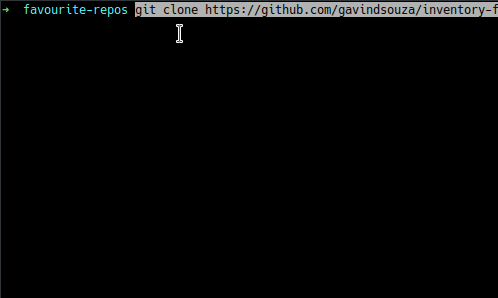

Create a virtual environment and install necessary dependencies:

```bash
$ python3 -m venv venv
$ source ./venv/bin/activate
$ pip install -U pip -e .
```

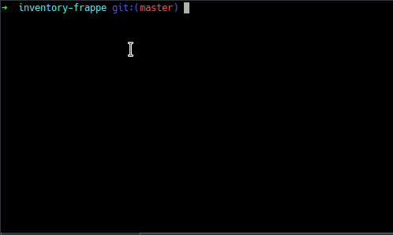


## Overview

The _index page_ or _summary_ covers the summary of the system containing lists of products and location along with a count of unallocated products.
On the _products page_, we can add/edit/remove products from the system. The _location page_ covers similar functionality in the context of locations or warehouses.
On the _logistics  page_, movement of products can be performed. It also maintains the history of all transactions in a tabular form.

## Usage

### Starting Things Up

To try out the application, run the following from the cloned directory:

``` sourceCode console
$ flask --app inventory.app run --debug
```

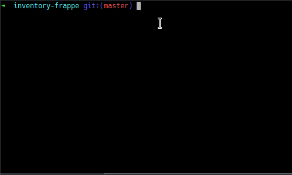

The application can be accessed at _localhost:5000_ in your browser

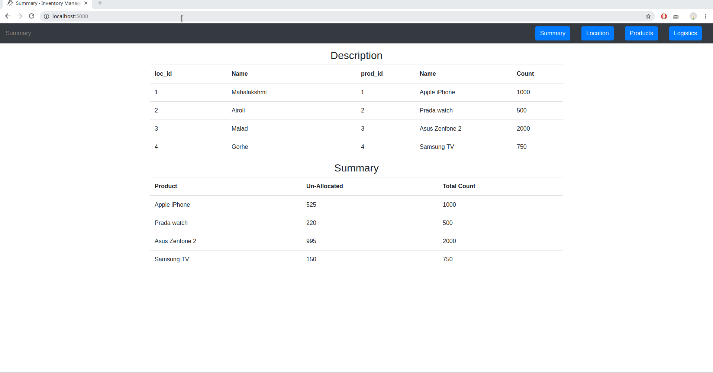

This view of the system can be accessed for demo purposes on installation, to start afresh remove thr inventory.sqlite file from the parent folder

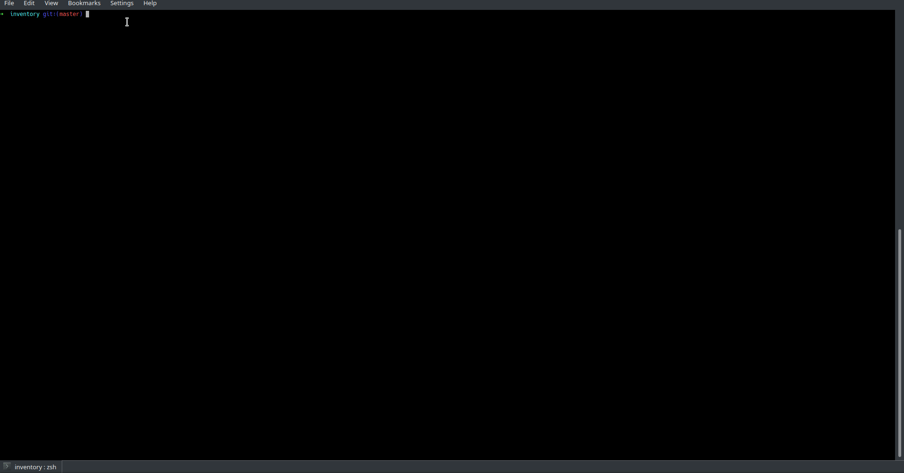

### Getting Into It

A new system will look like this

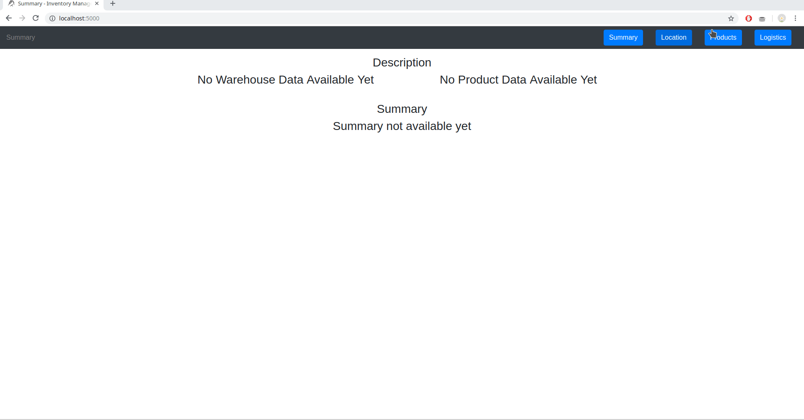

#### Adding Products and Locations

To add products, only the name and quantity are required
Adding locations needs only the name to be added

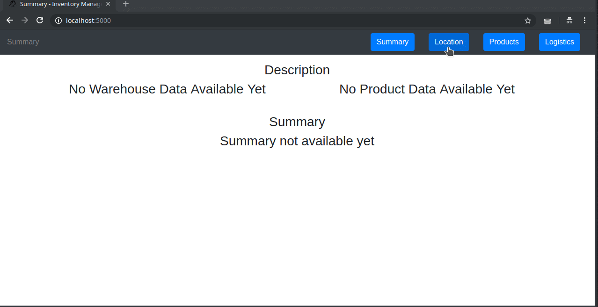

#### Moving Things Around

Products can be moved into and between warehouses *only after* they have been added to the system

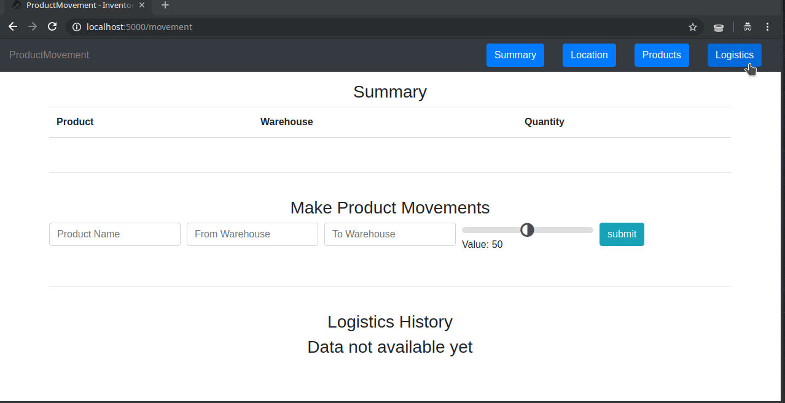

Moving into locations

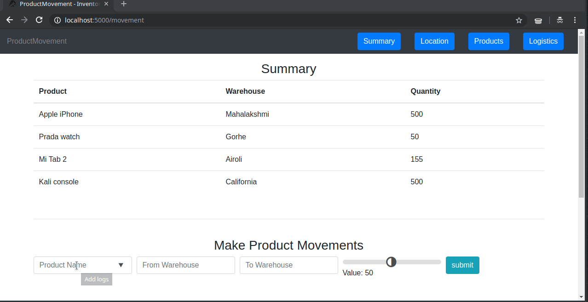

Moving between locations

#### Editing Existing Information

Editing Product Information

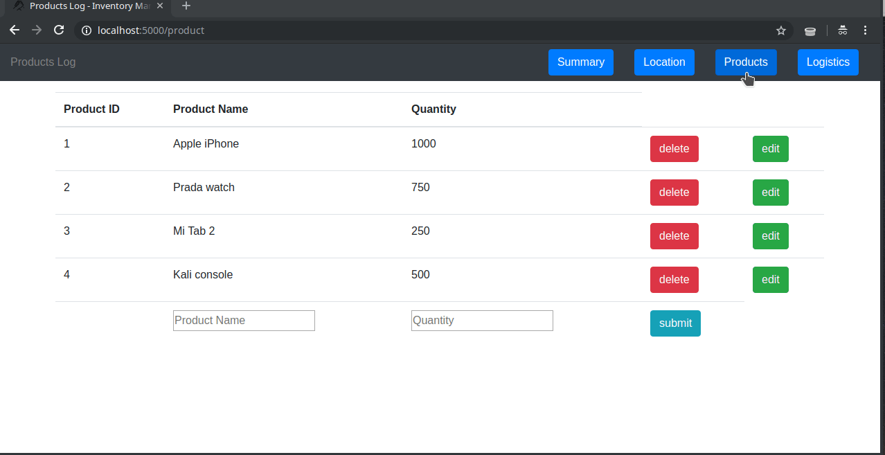

Editing Location Information

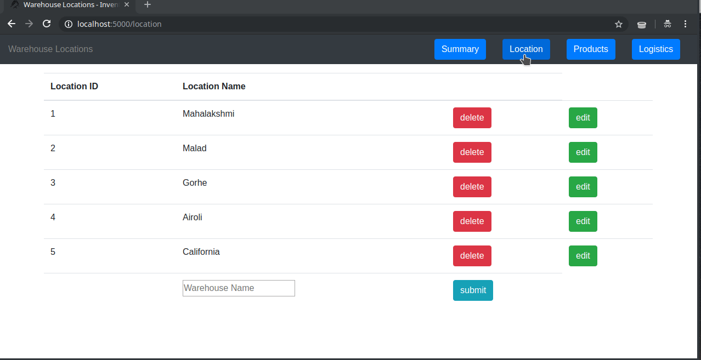

Deleting Products and Locations on the System

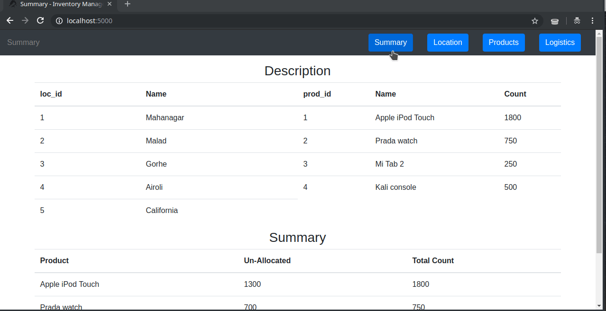

## Production Setup

You may want to maintain your database file in a separate location (by setting `DATABASE_NAME` environment variable) and back that up periodically. Considering `gunicorn` for this setup, equivalent command may look something like:

```bash
$ DATABASE_NAME=/home/user/inventory.sqlite gunicorn -w 4 inventory.app:app
```

Checkout Flask's production [deployment guide](https://flask.palletsprojects.com/en/2.2.x/deploying/) for more information.

## Dependencies

  - Just Flask\!

## License

This code has been released under the [MIT License](LICENSE).
